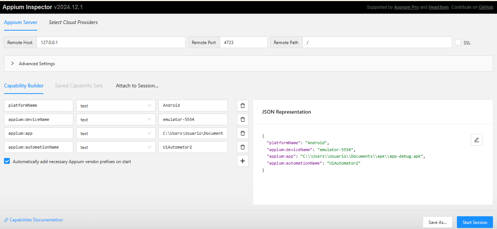

# 🤖 Automação de Testes Mobile com Java + Appium

Este projeto demonstra a automação de testes para um aplicativo Android utilizando **Java**, **Appium**, **JUnit 5** e boas práticas como **Page Object Model**.

---

## 📋 Índice

- [Pré-requisitos](#pré-requisitos)
- [Instalação do ambiente](#instalação-do-ambiente)
- [Configuração do projeto](#configuração-do-projeto)
- [Estrutura de pastas](#estrutura-de-pastas)
- [Executando os testes](#executando-os-testes)
- [Boas práticas adotadas](#boas-práticas-adotadas)
- [Exemplo de teste](#exemplo-de-teste)
- [Possíveis erros e soluções](#possíveis-erros-e-soluções)

---

## ✅ Pré-requisitos

Antes de começar, você precisa ter instalado:

- [Java JDK 11+](https://www.oracle.com/java/technologies/javase-jdk11-downloads.html)
- [Node.js + npm](https://nodejs.org/) (recomendado Node 16+)
- [Appium](https://appium.io/)
- [Android Studio (com AVD configurado)](https://developer.android.com/studio)
- [IntelliJ IDEA ou VSCode (com suporte Java)](https://www.jetbrains.com/idea/)
- [Appium Inspector](https://github.com/appium/appium-inspector)

---

## ⚙️ Instalação do ambiente

### 1. Instalar o Appium (global)

```bash
npm install -g appium
```
---
### 2. Verificar instalação com Appium Doctor
é uma ferramenta que diagnostica e sugere soluções para problemas de configuração do Appium, ajudando a garantir que o ambiente de testes esteja configurado corretamente.
```bash
npm install -g appium-doctor  
appium-doctor
```
📦 Se estiver usando Maven (pom.xml):
git clone https://github.com/seu-usuario/seu-repo.git
cd seu-repo;
mvn clean install
🔄 Isso vai baixar todas as dependências e compilar o projeto.

📌 Requisitos prévios
Certifique-se de ter instalado:

Java (JDK 11 ou superior) ✅

Appium (npm install -g appium) 📲

Appium Doctor (npm install -g appium-doctor) 🩺

Android SDK configurado com variáveis de ambiente (ANDROID_HOME) 📱

Appium Inspector (opcional para inspecionar elementos) 🔍
---
### 3. Iniciar o Appium Server
```
appium
```
```
📁 src  
└── 📁 main  
    └── 📁 java  
        ├── 📁 org.example          # Gerenciamento do driver  
        │   └── 📄 DriverManager.java  
        └── 📁 login                # Page + Testes de login  
            ├── 📄 LoginPage.java  
            └── 📄 LoginTest.java  

```

🔍 Appium Inspector
O Appium Inspector é uma ferramenta visual que permite inspecionar a hierarquia de elementos de um app mobile, facilitando a identificação dos elementos que você quer interagir nos seus testes automatizados.

Ele simula uma sessão real do Appium, permitindo que você veja os atributos dos elementos, suas localizações, e teste seletores como xpath, id, accessibility id, entre outros.

✅ Como usar
Acesse: https://inspector.appiumpro.com

No painel de configuração, adicione o JSON de capabilities:

Clique em "Start Session" para iniciar a inspeção do app.

🛠️ Exemplo de configuração (Desired Capabilities):
```
{
"platformName": "Android",
"appium:deviceName": "emulator-5554",
"appium:app": "C:\\Users\\Usuario\\Documents\\apk\\app-debug.apk",
"appium:automationName": "UiAutomator2"
}
```


🔸 Obs:

O campo "app" deve conter o caminho completo até o seu .apk.

Você também pode usar "appPackage" e "appActivity" caso o app já esteja instalado no emulador ou dispositivo.

Certifique-se de que o Appium Server esteja rodando localmente na porta padrão (4723) antes de iniciar a sessão no Inspector.